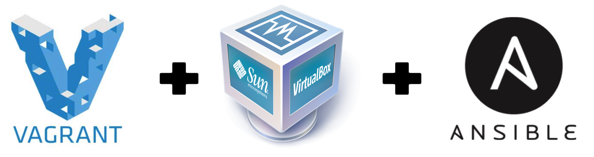

# Vagrant Ansible for java and node js develop


[](doc/img/VagrantVBAnsible.png)

## Background
The box install a number of open source tools to work properly:

* `Nodejs` - For JavaScript develop 
* `Java JDK8` - For Java develop 
* `Docker` - For Java develop 
* `SonarQube` - Static Analyses for java project 
* `JQ` For json commandline viewer

## Getting Started

This README file is inside a folder that contains a `Vagrantfile` (hereafter this folder shall be called the [vagrant_root]), which tells Vagrant how to set up your virtual machine in VirtualBox.

To use the vagrant file, you will need to have done the following:

  1. Download and Install [VirtualBox](https://www.virtualbox.org/wiki/Downloads)
  2. Download and Install [Vagrant](https://www.vagrantup.com/downloads.html)
  3. Install [Ansible](http://docs.ansible.com/intro_installation.html)
  4. Open a shell prompt (Terminal app on a Mac) and cd into the folder containing the `Vagrantfile`

Once all of that is done, you can simply type in `vagrant up`, and Vagrant will create a new VM, install the base box, and configure it.

Once the new VM is up and running (after `vagrant up` is complete and you're back at the command prompt), you can log into it via SSH if you'd like by typing in `vagrant ssh`. Otherwise, the next steps are below.

### Setting up your hosts file

You need to modify your host machine's hosts file (Mac/Linux: `/etc/hosts`; Windows: `%systemroot%\system32\drivers\etc\hosts`), adding the line below:

    192.168.45.10  develop.vm

If you'd like additional assistance editing your hosts file, please read [How do I modify my hosts file?](http://www.rackspace.com/knowledge_center/article/how-do-i-modify-my-hosts-file) from Rackspace.

### Vagrant provision with Ansible
Vagrant allows you to configure and use reproducible work environments on top of various virtualization and cloud platforms. It also has integration with Ansible as a provisioner for these virtual machines, and the two tools work together well.

```sh
.
├── doc
│   └── img
│       └── VagrantVBAnsible.png
├── provisioning
│   ├── docker
│   │   └── docker-compose.yml  //--> contain docker images to install 
│   ├── playbook.yml  //--> the root config file for ansible provisioning
│   └── roles
│       ├── angstwad.docker_ubuntu //--> contain ansible role for docker tools
│       ├── commandline_tools //--> contain role to install command tools
│       │   └── tasks
│       │       ├── jq.yml      //--> contain command and tasks to install JQ 
│       │       └── main.yml
│       ├── develop_tools  //--> contain role to install develop tools
│       │   └── tasks
│       │       ├── essential.yml
│       │       ├── java.yml
│       │       ├── main.yml
│       │       └── nodejs.yml
│       ├── devops_tools   //--> contain role to install devops tools
│       │   ├── tasks
│       │   │   ├── docker.yml  //--> contain tasks to configure docker install
│       │   │   ├── git.yml  	//--> contain tasks to configure git install
│       │   │   └── main.yml
│       │   └── vars
│       │       └── main.yml   //--> contain vars to configure develop role
│       └── os_config_tools
│           └── tasks
│               ├── global.yml
│               ├── gui.yml    //--> contain tasks to install ubuntu-gui 
│               └── main.yml
├── README.md
└── Vagrantfile              
```

## Author Information

Created in 2017 by [Oussama EL ABED](https://github.com/OElabed), Senior developer.

## Related links
- How to install ansible on Babun for windows. see [link](https://www.azavea.com/blog/2014/10/30/running-vagrant-with-ansible-provisioning-on-windows/) 
- How uses docker-compose. see [link](https://docs.docker.com/compose/gettingstarted/)
- Useful vagrant boxes with ansible provisionning. see [link](https://github.com/geerlingguy/ansible-vagrant-examples)

License
----

MIT